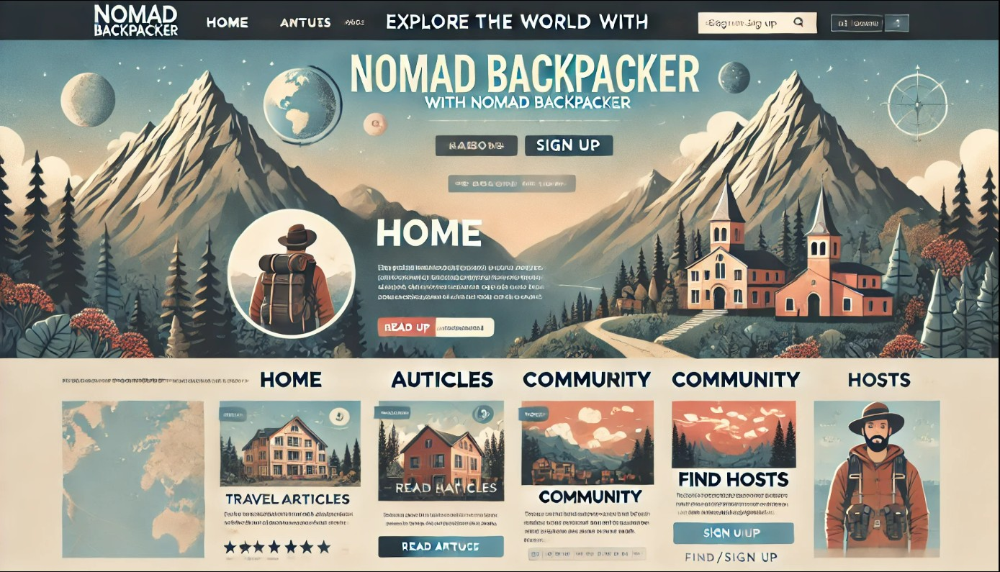
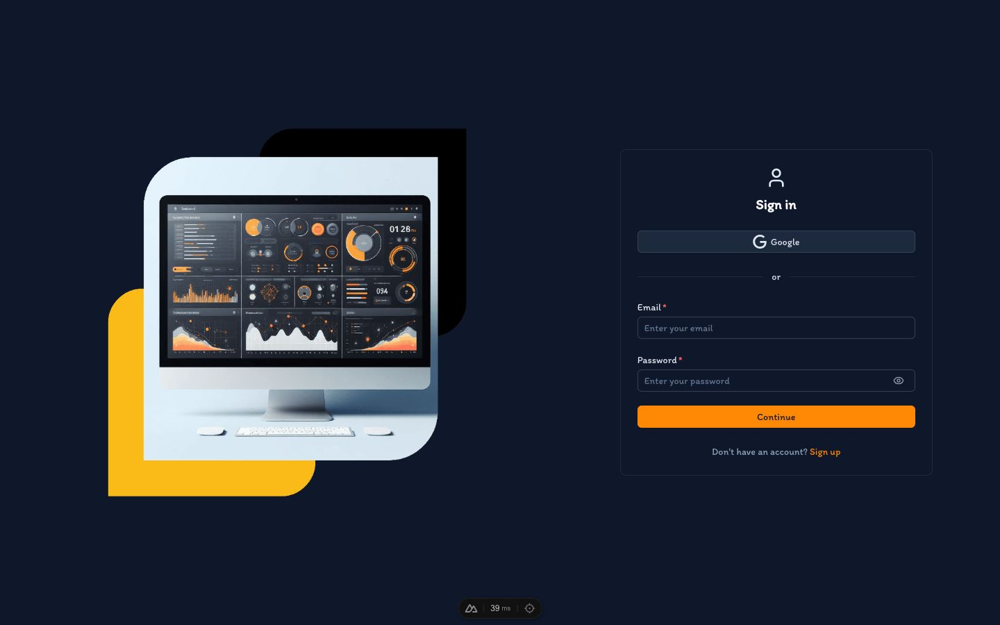
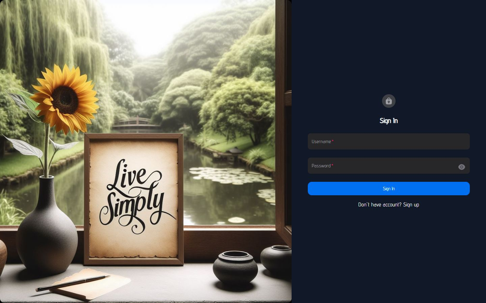

  

  <h1>ADILKHAN ASKAROV</h1>
  
<strong>Senior Frontend Developer · Mentor</strong>

  
Crafting bold, minimal interfaces with motion‑first UX.

  

    
    
    
    
  

---

## PROFILE

- Frontend developer focused on UI systems, landing pages, and motion design.
- Mentor who enjoys teaching and sharing practical knowledge.
- Currently sharpening **React** and **Redux**.

## EXPERIENCE SNAPSHOT

- **Kelnik Studios** — Senior Frontend Developer (Oct 2025 — Present)
- **Idaproject** — Team Lead Frontend (Jan 2025 — Oct 2025) · Middle Frontend (Feb 2023 — Jan 2025) · Frontend (Jan
  2022 — Feb 2023)
- **Sarawan** — Frontend Developer (Aug 2021 — Mar 2022)
- **GeekBrains** — Student Mentor (Dec 2020 — Dec 2021)
- **KAFI** — Other Experience (Nov 2019 — Dec 2021)

## FOCUS

- Product websites, portfolios, and high‑impact landing pages
- Interactive UI (GSAP, smooth transitions, micro‑motion)
- Clean architecture and scalable component systems

## TECH STACK

<h3>Frontend</h3>

  
  
  
  
  
  
  
  
  
  
  
  
  

<h3>Backend</h3>

  
  
  
  
  
  
  
  
  
  

<h3>Tools</h3>

  
  

<h3>DevOps</h3>

  

## SELECTED WORK

<table>
  <tr>
    <td>
      
       
      <strong>Nomad Backpacker</strong>
       
      Travel product interface and community flows
    </td>
    <td>
      
       
      <strong>AV Dashboard</strong>
       
      Data‑heavy admin UI
    </td>
    <td>
      
       
      <strong>Livesimply</strong>
       
		Personal finance app for expense tracking, budgeting, and financial insights.    
</td>
  </tr>
</table>

## CONTACT

- Email: **studio.askarov@gmail.com**
- Telegram: [@Adilhan96](https://t.me/Adilhan96)
- LinkedIn: https://www.linkedin.com/in/adilkhan-askarov-frontend

---

  © 2026 Adilkhan Askarov · All rights reserved

